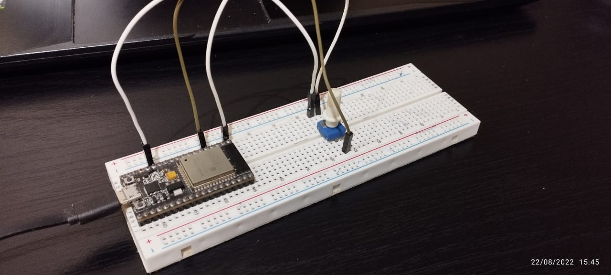

# ESP32-Side Code
This project assumes you have a decent amount of experience with using the ESP32 with the Arduino core, connecting to WiFi, and a basic understanding of HTTP requests. There are many well-written tutorials online if a refresher is needed. 

## Theory & Pre-requisites
> Connecting the ESP32 to enterprise WiFi is different and not covered in this tutorial. Only non-enterprise WiFi will work. A workaround is creating a hotspot with a PC or mobile device.

In this ESP32 Arduino sketch, we connect to WiFi and make a `PUT` request to the Deta Base server, using HTTP(hyper-text transfer protocol) over TLS(transport layer security protocol). According to the way we have set up our project, we want our database to have two fields: `key`, and `value`. `key` will store the current Unix time, as a unique value for a `value`, which will be some reading from a potentiometer. 

According to the [HTTP API Deta Docs](https://deta.space/docs/en/build/reference/http-api/base), we need to make the `PUT` request to the URL  `https://database.deta.sh/v1/{project_id}/{base_name}/items`, where we need to provide `{project_id}` and `{base-name}`. We also need to provide our project key in the `x-api-key` header of our request. We also need to provide the `content-type` header with the value `application/json`. 

Our request must contain a JSON payload describing what we want to put into the database. Along with this, the `content-length` header is also necessary, and must contain the size of our JSON payload. The payload must be in this format:
```json
{
	// array of items to put
	"items":  [
		{
			"key":  "myKey",  // optional, a random key is generated if not provided. Key muist always be a string
			"field1":  "something",
			// rest of item
		},
		// rest of items
	}
}
```
The above JSON can be minified(expressed in 1 line) if needed. This helps us, as we don't need to deal with new-lines within a the JSON payload string. [These sometimes create issues as different operating systems handle them differently](https://www.hanselman.com/blog/carriage-returns-and-line-feeds-will-ultimately-bite-you-some-git-tips#:~:text=Windows%20uses%20CRLF%20because%20DOS,OS%20X%20switched%20to%20LF.). 

All in all, our request will look something like this, assuming our project ID is `project_id` and our Base name is `simple_db`:
```http
PUT /v1/project_id/simple_db/items HTTP/1.1
Host: database.deta.sh
User-Agent: Arduino/1.0
Accept-Encoding: gzip, deflate
Accept: */*
Connection: keep-alive
Content-Type: application/json
x-api-key: someAPI_KEY12345790
Content-Length: 44
//intentional line skip
{"items":[{"key":"1660924934","value":101}]}
```
Some notes about this:
* Even though the [HTTP API Deta Docs](https://docs.deta.sh/docs/base/http/#put-items) mention the URL being `https://database.deta.sh/v1/{project_id}/{base_name}`, `items` is added to the end as it is necessary for the Put Items API. 
* **The `key` field must always be a string.** Hence, it is enclosed in double-quotes.
* The `Content-Length` value includes the double-quotes. These are calculated at runtime as the number of digits in the reading will be a factor in this.
* This will not work if the empty line between the payload and headers. 

## Code Set-Up
The code is divide divided into 3 files: `dataUpload.ino`, `secrets.cpp`, and `secrets.h`. The `secrets.cpp` contains project secrets like the WiFi credentials, Deta Project ID, Project Key, and Deta Base name. Change `secrets.cpp` to include all relevant information, and make sure `secrets.h` is included in `dataUpload.ino` so it can access the secret variables.


## Hardware Setup
Potentiometer connected to pin 34


# Main Code

## Definitions and Helper Functions
```c++
#include "secrets.h"
#include <WiFiClientSecure.h>
#include "time.h"

#define LED 2

const char* detaHost = "database.deta.sh";
const char* ntpServer = "pool.ntp.org";

int sample = -1;

const char* root_ca = \
"-----BEGIN CERTIFICATE-----\n" \
//not shown completely
"-----END CERTIFICATE-----\n";

WiFiClientSecure client;
char* URI = NULL;
unsigned long epochTime;
```
We include `secrets.h` to access our secret variables as described above, along with libraries that will help us  make the request and get the current unix timestamp. We will also use the on-board LED(connected to pin 2) on my board to indicate when a request is being made. We declare variables holding the hosts for Deta Base and our timer server. The int `sample` will the hold the reading from the potentiometer. The `root_ca` variable holds the root CA certificate for `database.deta.sh`. This required since we are using HTTPS and not HTTP. The root CA certificate is provided in the main code, so we don't need to provide it manually. See below if you want to learn how to get it manually anyway. 
> How to get Root CA certificate manually: Go to [https://database.deta.sh]. It doesn't matter if the site doesn't load properly or shows "Unauthorized". Just make sure your browser says it's a secure site (the lock symbol beside the URL). Click on the lock icon, and then view certificate. 
> 
> In Microsoft Edge, this is done by clicking lock icon, and then "Connection is secure", and then the certificate icon towards the top-right. In the window that opens, click the "Certification Path" tab, and then "Sectigo" (the highest{root} certificate). Once it is selected, click "View Certificate", and go to the "Details" tab. Click the "Copy to File..." button towards the bottom-right. A new window will open. Click "Next", and then select "Base-64 encoded X.509", and click "Next". Then click "Browse", and select a location and provide a file name to save the certificate. The file saves will have a `.cer` extension. Open this file using a text editor and you will see the certificate. It will look like a bunch of alphanumeric characters over multiple lines. `BEGIN CERTIFICATE` and `END CERTIFICATE` will be present towards the start and end of the certificate.
> 
> The variable `root_ca` is this text as multi-line c string, along with `\n` characters at the end of each line.

We create a `WiFiClientSecure` object to handle the connection, as well as a char pointer to hold the URI for the request, and an unsigned long to hold the unix timestamp.

```c++
unsigned long getTime() {
	time_t now;
	struct tm timeinfo;
	if (!getLocalTime(&timeinfo)) {
		//Serial.println("Failed to obtain time");
		return (0);
	}
	time(&now);
	return now;
}
```
This function uses the provided functionality by the Arduino core to get the Unix timestamp from the internet using `getTime()` and returns it. 

## Setup Function

```c++
Serial.begin(115200);
URI = (char *)malloc((strlen("/v1/") + strlen(detaID) + strlen("/") + strlen(detaBaseName) + strlen("/") + strlen("items") + 1 ) * sizeof(char));
strcpy(URI, "/v1/");
strncat(URI, detaID, strlen(detaID));
strncat(URI, "/", strlen("/"));
strncat(URI, detaBaseName, strlen(detaBaseName));
strncat(URI, "/", strlen("/"));
strncat(URI, "items", strlen("items"));
pinMode(LED, OUTPUT);
digitalWrite(LED, LOW);
```
Here we allocate space for the URI, and construct it from the secret variables. We also declare our LED pin as an output, and turn it off.

```c++
WiFi.begin(WifiSSID, WifiPass);
Serial.println("Waiting to connect to WiFi");
while (WiFi.status() != WL_CONNECTED) {
	delay(500);
	Serial.print(".");
} 
digitalWrite(LED, HIGH);
Serial.println();
Serial.println("WiFi connected");
client.setCACert(root_ca);
```
We connect to the WiFi network using our credentials defined in the `secrets.cpp` file. Including `WiFi.h` explicitly was not required since it is automatically included in the WiFiClient library which we have included as well. Once connected, we turn the LED on as a visual indicator, and then print to the Serial console as well. 
We then set our root CA certificate in our `WiFiClientSecure` object. 

```c++
configTime(0, 0, ntpServer);
epochTime = getTime();
while(epochTime == 0){
	Serial.println("Wrong time received. Trying again");
	epochTime=getTime();
}
Serial.print("Current epoch time:\t");
Serial.println(epochTime);
```
Here, we are receiving the current unix timestamp from the internet over NTP. The function `configTime` takes an offset for timezone and for daylight savings time and does some configuration internally. Since we don't care about those here, we provide 0 as arguments for both of those parameters. Then we use the `getTime()` function explained above to make the request for the time. We also print out the timestamp just make sure things are working okay.
> In my experience, this sometimes fails, and calling `getTime()` again usually fixes the error. Checking for 0 is a good way to check if an error occurred since the Unix timestamp will never be 0, [atleast until some time in the year 2486...](https://www.howtogeek.com/759337/what-is-the-unix-epoch-and-how-does-unix-time-work/)

## Loop Section
```c++
digitalWrite(LED, HIGH);
sample = analogRead(34);
epochTime += (millis()/1000);
Serial.print("Epoch Time: ");
Serial.println(epochTime);
Serial.print("Length: ");
Serial.println(String(epochTime).length());
Serial.print("Reading:\t");
Serial.println(sample);
```
We turn the LED on to show that we are making a request, and then read the potentiometer for a value to upload. We also add the time elapsed since the microcontroller started to the original epoch time, for a decently accurate measure of time, and print out some information to make sure everything is working correctly. 

```c++
if (client.connect("database.deta.sh", 443)) {
	Serial.println("Connected to server");
	client.print("PUT ");
	client.print(URI);
	client.println(" HTTP/1.1");
	client.println("Host: database.deta.sh");
	client.println("User-Agent: Arduino/1.0");
	client.println("Accept-Encoding: gzip, deflate");
	client.println("Accept: */*");
	client.println("Connection: keep-alive");
	client.println("Content-Type: application/json");
	client.print("x-api-key: ");
	client.println(apiKey);
	client.print("Content-Length: ");
	client.println(String(sample).length() + String(epochTime).length() + 32);
	client.println();
	client.print("{\"items\":[{\"key\":\"");
	client.print(String(epochTime));
	client.print("\",\"value\":");
	client.print(String(sample));
	client.println("}]}");
} else {
	Serial.println("Could not connect to server");
	while (true);
}
```
We use the function `connect()` to connect to the host URL, and then we start printing the request based on the requirements above. Make sure to carefully notice how the length of the payload is calculated, where 32 is the length of the fixed portions. 
> Double-quotes are necessary for representing strings in JSON, and are represented as an escape character `\"` in C.   `\"` is counted as 1 character, not 2.

If we are not able to connect to the server, we stop program execution for debugging using `while(true);`. This can be removed if needed. 

```c++
digitalWrite(LED, LOW);
unsigned long timeout = millis();
while (client.available() == 0) {
	if (millis() - timeout > 5000) {
		Serial.println(">>> Client Timeout !");
		client.stop();
		return;
	}
	delay(5);
}

// Read all the lines of the reply from server and print them to Serial

while (client.available()) {
	String line = client.readStringUntil('\r');
	Serial.print(line);
}

client.stop();
Serial.println();
Serial.println("closed connection");
delay(200);
```
We turn the LED off to indicate that the request has been sent. We now wait for the response, which has a payload expected in the following format if everything succeeds, along with a 200 level response status code:
```json
{
	"processed": {
		"items": [
			// items which were stored
		]
	},
	"failed": {
		"items": [
			// items failed because of internal processing
		]
	}
}
```
If something went wrong, we will receive a response with a payload in the following format, along with a 400 level response status code:
```json
{
	"errors" : [
		// error messages
	]
}
```
Regardless of the result, it makes sense to print out the entire HTTP response. 
> [Here is more information on HTTP response status codes](https://developer.mozilla.org/en-US/docs/Web/HTTP/Status).

While the server is processing our request, we don't receive anything in the `WiFiClientSecure` buffer. So we can check this waiting state with `while (client.available() == 0) {}`. However, we don't want to create an infinite loop situation in case the server never responds for whatever reason. Hence, we put in a timeout for 5 seconds using `millis()`. If there is a timeout, we stop the `WiFiClientSecure` client object.

If we get some response in the buffer, we print it out line by line. We read till the character `\r`, which is the carriage return(CR) character mentioned in the above discussion about LF vs CRLF.

Once we finish writing out the response, we stop the client, and print to the Serial monitor that writing to the server has finished. A 200ms delay is added for readability in the Serial monitor, but is not requirement.  
